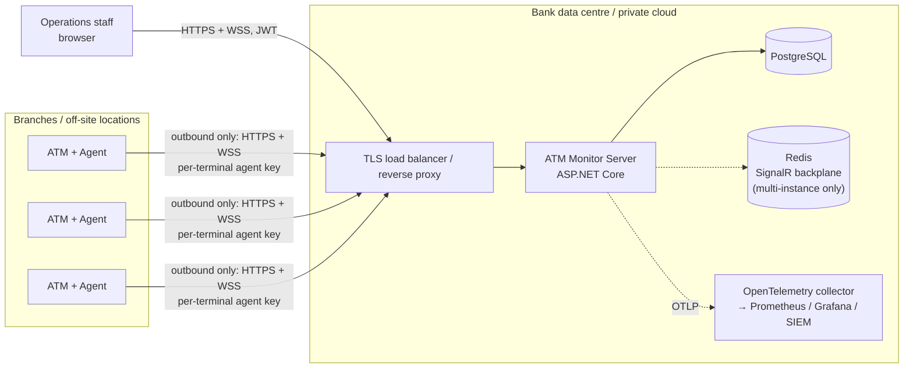
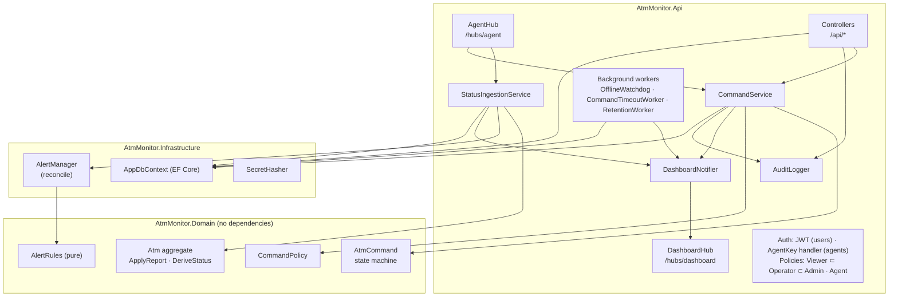
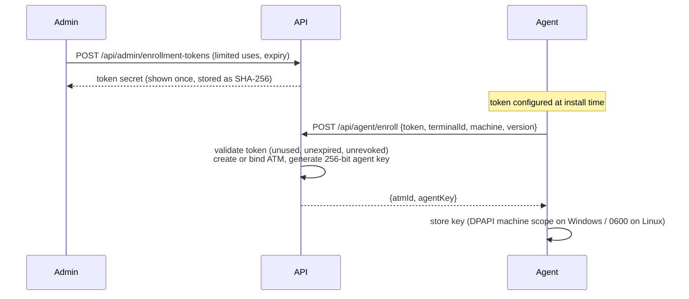
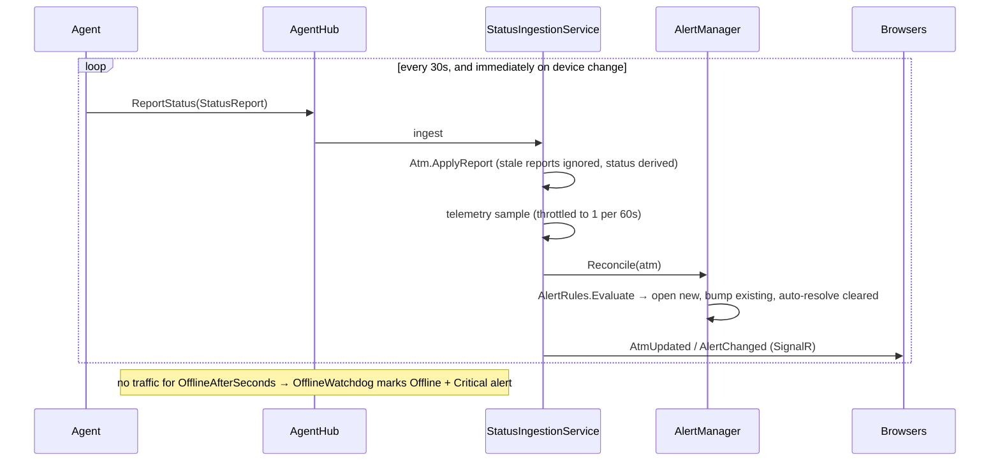
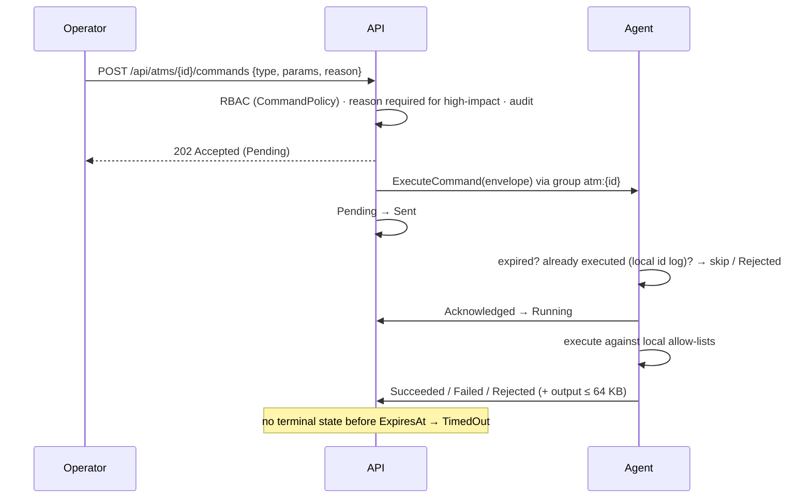
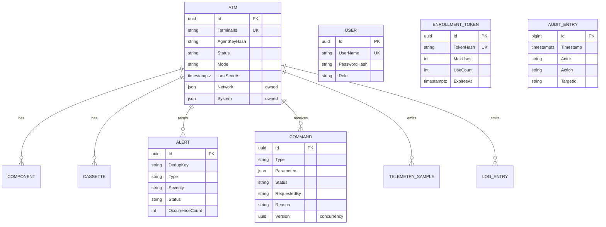

# Architecture

ATM Fleet Monitor watches a fleet of ATMs in real time: terminal health, device status, cash levels, network
quality and host metrics. It collects terminal logs, raises and tracks alerts, and lets authorised operators run
**audited, allow-listed** remote commands.

## 1. System context



Key property: **agents only make outbound connections.** Nothing has to listen on the terminal. Commands travel
back down the WebSocket that the agent opened. That fits the usual ATM network policy (terminals on an
isolated VLAN with egress allowed only to specific hosts).

## 2. Containers

| Container | Tech | Responsibility |
|---|---|---|
| **Agent** (`src/Agent`) | .NET 10 Worker Service (Windows Service / systemd) | Collects device, cash, network and system state. Tails log files. Keeps a persistent SignalR connection. Executes commands against local allow-lists. Buffers to local SQLite while offline. |
| **Server API** (`src/Server/AtmMonitor.Api`) | ASP.NET Core 10, SignalR, EF Core | Agent hub, dashboard hub, REST API, authentication and authorisation, alert engine, command lifecycle, background jobs (offline watchdog, command timeouts, retention). Serves the SPA. |
| **Web console** (`web/`) | React 19, TypeScript, Vite, TanStack Query, SignalR JS | Operator UI: fleet dashboard, terminal drill-down, telemetry charts, logs, alerts, commands, admin. |
| **Database** | PostgreSQL 15+ (SQLite for dev/tests) | Terminals, current state, alerts, commands, telemetry, logs, audit. |
| **Backplane** (optional) | Redis | Fans SignalR messages across API instances. |

## 3. Server components



Layering: `Contracts` (wire types shared with the agent) ← `Domain` (entities and pure rules) ← `Infrastructure`
(EF Core, hashing, alert reconciliation) ← `Api` (transport, auth, orchestration). The domain has no framework
dependencies, so it is unit-tested directly.

## 4. Key flows

### 4.1 Enrollment



Re-enrolling an existing terminal **rotates** its key and drops any live connection that uses the old key.

### 4.2 Status reporting and alerting



**Status derivation** (`Atm.DeriveStatus`), in priority order:

1. The watchdog has marked the terminal **Offline**.
2. Mode is Supervisor or Maintenance → **Maintenance**.
3. Mode is OutOfService, or a critical device (card reader, dispenser, PIN pad, display) is in Error or Offline → **OutOfService**.
4. Any device warning or error, a low, empty, full or missing cassette, an unreachable host, or a network interface down → **Degraded**.
5. Otherwise → **Online**.

**Alerts** are *state-derived* and deduplicated by `(type, key)`, e.g. `CashLow:cassette:CST2`. A condition that
persists bumps `OccurrenceCount` rather than creating noise. A condition that clears auto-resolves. While a terminal
is offline its device and cash alerts are *frozen*, not resolved, because the last known state is stale.
*Event* alerts such as `CommandFailed` never auto-resolve.

### 4.3 Remote commands



Delivery is **at-least-once with idempotent execution**:

- Pending and Sent commands are re-sent whenever the agent reconnects.
- The agent records each executed command ID in its local store *before* running it, so a redelivery never runs a
  command twice. A reboot will never loop.
- Agent → server updates go through a durable on-disk outbox and are applied through a state machine that
  ignores duplicate or out-of-order updates. A concurrency token prevents races between instances.

**Defence in depth for commands.** The server decides *who* may ask. The terminal decides *what* it will do:

- `RunScript` only runs scripts named in the terminal's own configuration, with fixed arguments and no shell.
- `RebootMachine` requires `Agent:AllowReboot=true` on the terminal.
- `CollectLogs` reads only configured sources.

A compromised server therefore cannot run arbitrary code on the fleet.

### 4.4 Offline resilience (agent)

- The connection loop reconnects with **full-jitter exponential backoff** (1–60 s), so thousands of terminals do not
  stampede a restarted server.
- Logs and command results are written to a bounded SQLite **outbox** (FIFO, 50k items by default) and flushed in
  order after reconnecting.
- Status snapshots are not buffered, because a newer snapshot supersedes an older one. A fresh report is pushed on
  reconnect.

## 5. Data model (simplified)



Enums are stored as strings, which keeps them readable and safe to reorder. Retention (`RetentionWorker`) purges
telemetry after 30 days, logs after 90, resolved alerts and completed commands after 180, and audit records after
7 years. All of these are configurable.

## 6. Scalability

Sizing assumptions: 5,000 terminals, one status report every 30 s, about 170 msg/s. Telemetry is throttled to one
sample per minute per terminal, about 7.2 M rows per day, or about 216 M rows at 30-day retention. Postgres handles
this with the `(AtmId, Timestamp)` index. Beyond that, partition by time or move to TimescaleDB (see roadmap).

| Concern | Approach |
|---|---|
| WebSocket fan-in | A single instance comfortably holds several thousand idle SignalR connections. Scale out horizontally behind a load balancer; enable the **Redis backplane** (`ConnectionStrings:Redis`) so group sends reach the instance holding the agent. |
| Background jobs | Written to be safe on several instances at once: set-based deletes, concurrency tokens on commands, and idempotent offline marking. For large fleets run them on one instance (`BackgroundJobs:Enabled=false` elsewhere). |
| Dashboard load | Real-time events are *invalidation hints*. The browser coalesces them per animation frame and refetches only the affected queries. |
| Read load | All list endpoints are paged (max 500). Summary queries aggregate in SQL. |

## 7. Technology decisions

See [`docs/adr`](adr/) for the full records.

| ADR | Decision |
|---|---|
| [0001](adr/0001-signalr-for-agent-transport.md) | SignalR over WebSockets for bidirectional agent transport |
| [0002](adr/0002-postgresql.md) | PostgreSQL as the system of record; SQLite only for dev and tests |
| [0003](adr/0003-agent-authentication.md) | Enrollment token → per-terminal agent key (hashed), with mTLS as an optional edge layer |
| [0004](adr/0004-command-safety.md) | Two-sided command authorisation: server RBAC plus terminal-local allow-lists |
| [0005](adr/0005-device-abstraction.md) | `IDeviceProvider` abstraction; simulator first, vendor XFS adapters per estate |

## 8. Repository layout

```
src/
  Shared/AtmMonitor.Contracts      wire protocol shared by server and agent
  Server/AtmMonitor.Domain         entities, status derivation, alert rules, command state machine, policy
  Server/AtmMonitor.Infrastructure EF Core (PostgreSQL/SQLite), migrations, alert reconciliation, hashing
  Server/AtmMonitor.Api            ASP.NET Core host: REST, hubs, auth, background jobs, SPA hosting
  Agent/AtmMonitor.Agent           Worker service for terminals
web/                               React console
tests/                             xUnit: domain, API integration (incl. SignalR round-trip), agent
deploy/                            Dockerfiles, Windows installer, systemd unit
docs/                              this documentation
```
